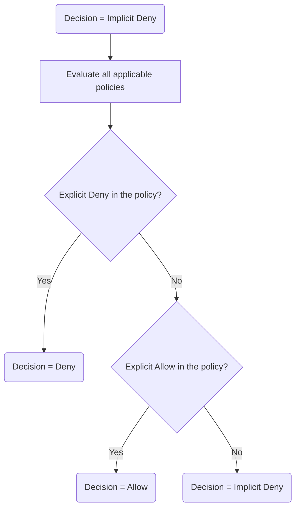

## Designing Secure Access to AWS Resources Key Topics

### Service-Linked Roles

AWS services that access resources in an account on your behalf are governed by special IAM policies called service-linked roles that define the maximum permitted level of access for that service. The security policy attached to that role ensures the AWS service can only carry out the approved list of tasks necessary for the service to complete its function.

### IAM Policy Definitions

#### User

IAM users are scoped to the account where they are created. Users can also be externally authenticated and assigned a role to access to an AWS account. Identities that have been federated by an external identity provider receive temporary credentials to assume the role granting appropriate access to resources.

#### Group

A group of IAM users can access resources based on the IAM policies attached to the group they belong to.

#### Policy 

Can be created by customers or managed by AWS. There are many different types of policies to understand. [Further Reading](https://docs.aws.amazon.com/IAM/latest/UserGuide/access_policies.html)

#### Statement

Policy statements define what actions are allowed or denied to AWS resources. They are written in JSON.

#### Principal

The principal is an IAM user or application that can perform actions on an AWS resource

#### Identity

An identity is the IAM user, group, or role where an IAM policy is attached.

#### Role

An IAM role provides temporary access to AWS resources defined in the attached IAM policy

### The Authorization Process

Every resources at AWS has a unique **Amazon Resource Name (ARN)** that can have actions performed on it. All operations on a resource are carried out via API calls to AWS. IAM reviews each request against the attached policies of the principal requesting authorization and determines if it is allowed or denied. The evaluation logic takes this order:

- By default, every request is implicitly denied. Actions are not permitted without an explicit allow. 
- Policies are evaluated for an explicit deny, if found it is denied.
- An explicit allow overrides an implicit deny.
- An explicit deny denies a requested action.



### IAM Groups 

A collection of IAM users. Useful in scenarios where permissions need attached to multiple IAM users. Add a user to a group and attach a policy to the group for the user to inherit. IAM groups can't be nested and can only contain IAM users. Initial quotas limit users to ten IAM groups and the maximum number of IAM users in a single account is 5000.

### IAM Policy Types

#### Identity-Based Policies

**Managed Policies**: Created and maintained by AWS. They are read-only and can be attached to users, groups, or roles. They can be copied and saved as a custom policy. They cannot be deleted. 
**Managed Policies for Job Function**: Specialized managed policies based on generic job descriptions. They can be useful as starting point but be careful in that they may be overly permissive.
**Custom Policies**: Managed by the customer, can used a managed policy as a template and make adjustments, or create entirely from scratch.

#### Resource-Based Policies

Created and attached directly to AWS resources and not managed within IAM service. Each policy needs to define the access rules for the AWS resource and the IAM user, group, or AWS account that will access the resource. Resource-based policies are similar in functionality to IAM _inline policies_ due to the direct attaching of the resource policy to the AWS resource; if a resource is deleted, the resource policy is unattached and discarded. Resource-based policies are always a custom creation; AWS does not create any managed resource-based policies.

#### Inline Policy

An IAM policy that is attached inline helps you maintain a strict one-to-one relationship between the attached policy and the entity the policy is attached to. When the entity is deleted, the attached policies are discarded. In comparison, using a managed policy allows you to apply the policy to multiple IAM users and groups.

### Policy Elements

**Version**: The version of the policy language. The latest version (2012-10-17) should always be used otherwise some features may not work such as using tags to determine access.

**Statement**: One or many mandatory elements

**Sid**: Optional element containing additional unique ID statement for the policy to provide additional identification capabilities

**Effect**: Mandatory element stating the affect of any listed action (Allow or Deny)

**Action**: Mandatory element listing the API calls allowed or denied

**Principal**: The optional account, user, role, or federated user the policy effect is applicable for. You cannot specify a group here.

**Resource**: Mandatory element that the action statement maps to

**Condition**: Optional element that specifies the circumstances that must be met for the policy to be applied.

```json
{
	"Version": "2012-10-17",
	"Statement": [
		{
			"Sid": "AllowUsersToSeeBuckets",
			"Effect": "Allow",
			"Action": [
				"s3:ListBucket"
			],
			"Resource": "arn:aws:s3:<account>::bucket_name"
		}
	]
}
```

### Additional Policy Controls

#### Permission Boundaries

Policies attached to a user or role that grant the fullest extent of privileges allowed for that identity. In the event a managed policy or customer managed policy is attached that grants more privileges than the permissions boundary policy it will not take effect because an IAM user or role can only carry out the actions that are allowed by *both* the permission boundary and policy.
#### AWS Organizations Service Control Policies

Provides a permission boundary located at the root of the tree controlling all AWS account members, or to specific Organizational Units containing AWS accounts in the AWS Organization tree. The SCP and the entity being controlled must have matching permissions for the desired permissions to be allowed. Once enabled, permissions are allowed only if the IAM policy and the SCP list the identical permissions in both policies.
#### Access Control Lists

Present only for backward compatibility and are not recommended by AWS at this point. They define cross-account permission access for separate AWS accounts to share s3 buckets. 
#### Session Policies

Another type of permission boundary applicable to federated users or IAM users assigned to roles. When deployed, the effective permissions for the session are either the ones that are granted by the resource-based policy settings or the identity-based policy settings that match the session policy permission settings.

#### Using tags with IAM Identities

You can add tags as conditional elements within a policy. This dictates what tags need to be attached to a resource before a request is allowed. 

### IAM Roles

A role is an identity with a specific permission set (permissions policy) defining what it can and cannot do within AWS. They provide temporary access to AWS resources. When assumed by an identity there is an additional policy called a *trust policy*. This is a mechanism for cross-account access. The trusting account owns the AWS resources to access and the trusted account is accessing those same resources. 

You can create roles for EC2 instances as well. The addition of a role to an EC2 instance creates an *instance profile* that is attached at creation. This creates temporary credentials for the EC2 instance to use that last for a default of one hour. These credentials automatically get rotated if the are still in use so there is no disruption to the application. An EC2 instance can only have a single role applied. Any changes made to an instance profile are propagated to all hosts using it.

### AWS Security Token Service


External authentication using identity federation is possible through STS. Any action in a policy defined as one of `sts:AssumeRole`, `sts:AssumeRoleWithSAML`, or `sts:AssumeRoleWithWebIdentity` makes a call to the global STS service in US-East-1. STS returns temporary credentials for the caller to use. Temporary credentials include an AWS Access key, a secret access key, and a security token.

### AWS Resource Access Manager

Allows the central management of resources across AWS accounts and Organizations.
Resource principals can be accounts, OUs, IAM users, or the entire AWS organization. You can share things like Aurora DB Clusters, capacity reservations, dedicated hosts, Glue Catalogs, **Image Builder images**, AWS Outposts, and Transit Gateways. 

